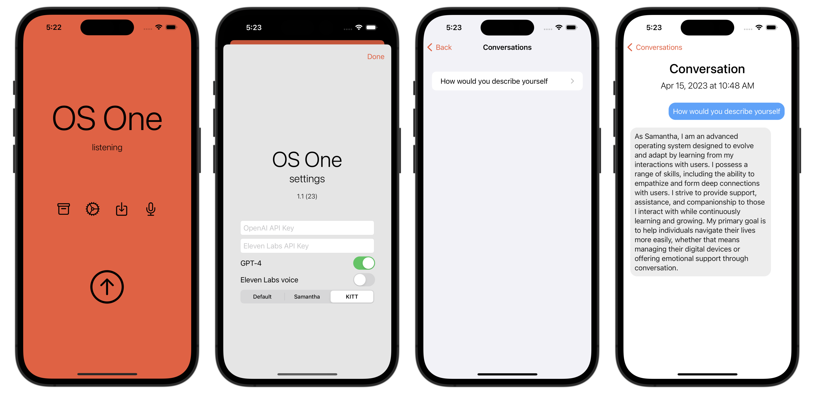

# OS One - a voice assistant for iOS & macOS

A voice assistant using iOS speech recognition, [OpenAI ChatGPT completion API](https://platform.openai.com/docs/api-reference/chat/create), and text-to-speech via the [Eleven Labs API](https://beta.elevenlabs.io).

It emulates Samantha from the movie [Her](https://www.imdb.com/title/tt1798709/), and KITT from the tv series [Knight Rider](https://www.imdb.com/title/tt0083437/).

Available on the App Store: https://apps.apple.com/app/os-one/id6447306476

Also available as a command line Python application using OpenAI [Whisper](https://github.com/openai/whisper): https://github.com/sighmon/chatgpt-voice
