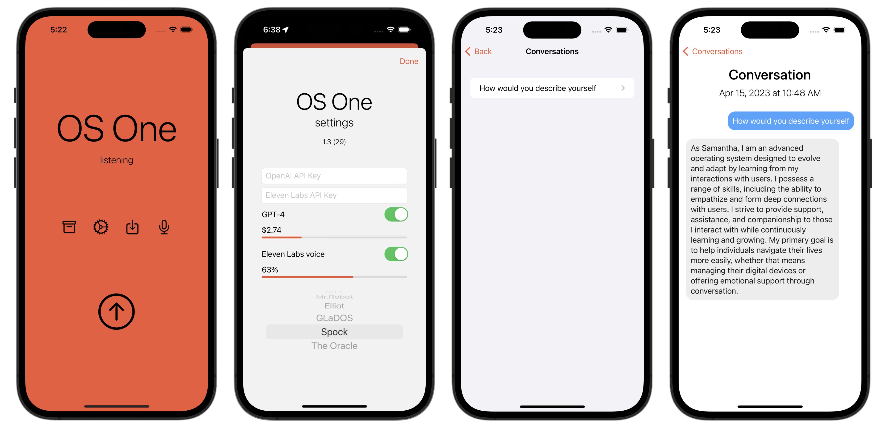

# OS One - a voice assistant for iOS & macOS

A voice assistant using iOS speech recognition, [OpenAI ChatGPT completion API](https://platform.openai.com/docs/api-reference/chat/create), and text-to-speech via the [Eleven Labs API](https://beta.elevenlabs.io).

It emulates Samantha from the movie [Her](https://www.imdb.com/title/tt1798709/).

Other assistants include:

* KITT from the tv series [Knight Rider](https://www.imdb.com/title/tt0083437/).
* Elliot and Mr.Robot from the tv series [Mr.Robot](https://www.imdb.com/title/tt4158110/)
* GLaDOS from the videogame [Portal](https://www.igdb.com/games/portal)
* Spock from the tv series [Star Trek](https://www.imdb.com/title/tt5171438/)
* The Oracle from the movie [The Matrix](https://www.imdb.com/title/tt0133093/)
* Janet from the tv show [The Good Place](https://www.imdb.com/title/tt4955642/)
* J.A.R.V.I.S. from the movie [Iron Man](https://www.imdb.com/title/tt0371746/)
* Johnny 5 from the movie [Short Circuit](https://www.imdb.com/title/tt0091949/)
* Clawdbot [clawd.bot](https://clawd.bot)

Authors:

* [Martha Wells (Murderbot series)](https://en.wikipedia.org/wiki/Martha_Wells), read by Kevin R. Free

My parents favourite people:

* [Amy Remeikis](https://www.theguardian.com/profile/amy-remeikis)
* [Jane Caro](https://en.wikipedia.org/wiki/Jane_Caro)

Some machine learning experts:

* [Fei-Fei Li](https://en.wikipedia.org/wiki/Fei-Fei_Li)
* [Andrew Ng](https://en.wikipedia.org/wiki/Andrew_Ng)
* [Corinna Cortes](https://en.wikipedia.org/wiki/Corinna_Cortes)
* [Andrej Karpathy](https://en.wikipedia.org/wiki/Andrej_Karpathy)

And some philosophers:

* [Judith Butler](https://en.wikipedia.org/wiki/Judith_Butler)
* [Noam Chomsky](https://en.wikipedia.org/wiki/Noam_Chomsky)
* [Angela Davis](https://en.wikipedia.org/wiki/Angela_Davis)
* [Slavoj Žižek](https://en.wikipedia.org/wiki/Slavoj_Žižek)

Available on the App Store: https://apps.apple.com/app/os-one/id6447306476

## Hints

* If the voice recognition is inaccurate, tap the recognised speech to reset it
* In the conversation archive, pull down to reveal a search bar to search your conversations
* In the conversation archive detail view, tap one of your previous conversations to re-play the audio again
* Tapping the + icon allows you to continue conversations

## Links

It started off life as a command line Python application using OpenAI [Whisper](https://github.com/openai/whisper): https://github.com/sighmon/chatgpt-voice

