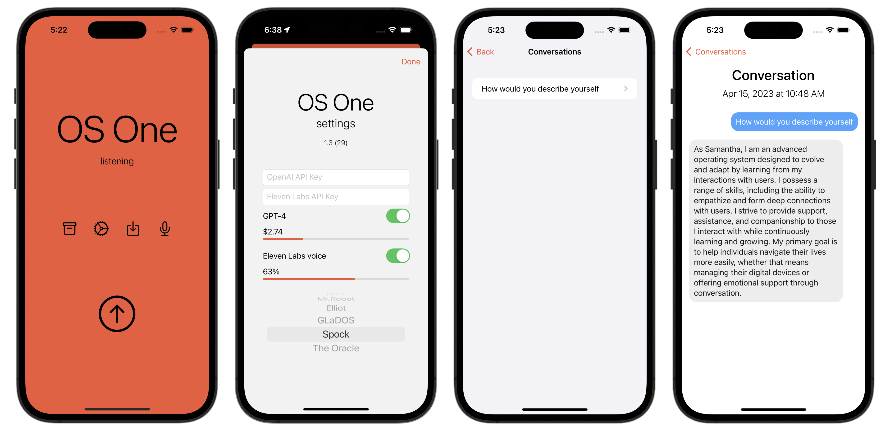

# OS One - a voice assistant for iOS & macOS

A voice assistant using iOS speech recognition, [OpenAI ChatGPT completion API](https://platform.openai.com/docs/api-reference/chat/create), and text-to-speech via the [Eleven Labs API](https://beta.elevenlabs.io).

It emulates Samantha from the movie [Her](https://www.imdb.com/title/tt1798709/).

Other assistants include:

* KITT from the tv series [Knight Rider](https://www.imdb.com/title/tt0083437/).
* Elliot and Mr.Robot from the tv series [Mr.Robot](https://www.imdb.com/title/tt4158110/)
* GLaDOS from the videogame [Portal](https://www.igdb.com/games/portal)
* Spock from the tv series [Star Trek](https://www.imdb.com/title/tt5171438/)
* The Oracle from the movie [The Matrix](https://www.imdb.com/title/tt0133093/)
* Janet from the tv show [The Good Place](https://www.imdb.com/title/tt4955642/)
* J.A.R.V.I.S. from the movie [Iron Man](https://www.imdb.com/title/tt0371746/)
* Johnny 5 from the movie [Short Circuit](https://www.imdb.com/title/tt0091949/)
* Clawdbot [clawd.bot](https://clawd.bot)

Authors:

* [Martha Wells (Murderbot series)](https://en.wikipedia.org/wiki/Martha_Wells), read by Kevin R. Free

My parents favourite people:

* [Amy Remeikis](https://www.theguardian.com/profile/amy-remeikis)
* [Jane Caro](https://en.wikipedia.org/wiki/Jane_Caro)

Some machine learning experts:

* [Fei-Fei Li](https://en.wikipedia.org/wiki/Fei-Fei_Li)
* [Andrew Ng](https://en.wikipedia.org/wiki/Andrew_Ng)
* [Corinna Cortes](https://en.wikipedia.org/wiki/Corinna_Cortes)
* [Andrej Karpathy](https://en.wikipedia.org/wiki/Andrej_Karpathy)

And some philosophers:

* [Judith Butler](https://en.wikipedia.org/wiki/Judith_Butler)
* [Noam Chomsky](https://en.wikipedia.org/wiki/Noam_Chomsky)
* [Angela Davis](https://en.wikipedia.org/wiki/Angela_Davis)
* [Slavoj Žižek](https://en.wikipedia.org/wiki/Slavoj_Žižek)

Available on the App Store: https://apps.apple.com/app/os-one/id6447306476

## Hints

* If the voice recognition is inaccurate, tap the recognised speech to reset it
* In the conversation archive, pull down to reveal a search bar to search your conversations
* In the conversation archive detail view, tap one of your previous conversations to re-play the audio again
* Tapping the + icon allows you to continue conversations

## Links

It started off life as a command line Python application using OpenAI [Whisper](https://github.com/openai/whisper): https://github.com/sighmon/chatgpt-voice

## Settings and camera

Settings has Personality, Models, and Settings tabs. Choose one assistant provider: OpenAI, xAI / Grok, Apple Foundation Models, or OpenClaw. Existing Grok/gateway preferences and custom model IDs are preserved. The cloud model menus default to Latest; this resolves to the first entry in the maintained `ModelCatalog` (verified against the [OpenAI catalog](https://developers.openai.com/api/docs/models) and [xAI catalog](https://docs.x.ai/developers/models)). Explicit model selections stay pinned. Gateway models are managed on the gateway.

Apple Foundation Models requires iOS 26 and an eligible device with Apple Intelligence enabled and its model downloaded. The Models tab reports readiness. This integration supports text conversations and personality instructions, but no images, web search, or HomeKit tools. Choose System voice for local speech output. Speech recognition follows the system's own availability and network requirements.

With OpenAI or xAI selected, the camera button enables a full-screen rear-camera preview. The app attaches only the latest captured frame for each spoken turn, after a final speech result or three seconds of silence. The preview stops while settings, archives, or HomeKit are open, or the app is inactive. Camera denial, interruption, and missing frames are reported instead of sending an old frame.

Device checks: verify camera permission denial/recovery, portrait and landscape framing, background/foreground transitions, and two successive spoken turns pointing at different objects. Verify Apple's available, disabled, and downloading states on eligible hardware; the simulator cannot validate on-device generation or a live camera.

Voice output can use System, ElevenLabs, OpenAI, or Grok Voice independently of the assistant model. Selecting Grok Voice with an API key loads `GET https://api.x.ai/v1/tts/voices`; the selected voice is used by `POST /v1/tts`. OpenAI shows all 13 documented built-in API voices and uses `gpt-4o-mini-tts` (OpenAI does not currently expose a built-in voice-list GET endpoint). Both cloud selectors use wheels and remember their voice IDs separately. Grok voice loading can be refreshed, and API errors are shown in settings.

OpenAI and Grok model menus refresh from each provider's authenticated `/v1/models` endpoint when the Models tab opens with a key, when the key changes, or when Refresh models is tapped. The model-name field accepts custom IDs and preserves them when lists change. Clearing it restores the maintained Latest default. Without a key, or if discovery fails, built-in choices remain available. API lists can include non-chat models, so choose a conversation model with the capabilities you use.
