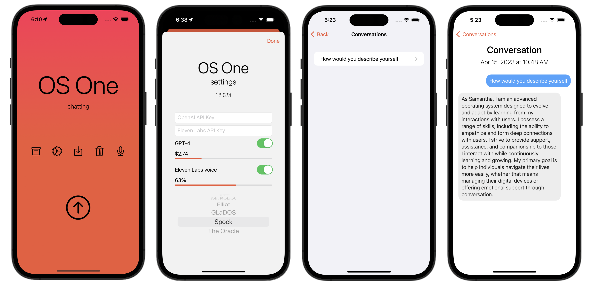

# OS One - a voice assistant for iOS & macOS

A voice assistant using iOS speech recognition, multiple AI model providers, and text-to-speech.

**Model Providers:**
- 🔒 **Local (MLX)** - On-device inference with Qwen/Llama models (iOS & macOS)
- ⚡ **Haiku 4.5** - Claude Sonnet 4.5 Haiku API (iOS & macOS)
- 🦙 **Ollama** - Local models via Ollama server (macOS only)

It emulates Samantha from the movie [Her](https://www.imdb.com/title/tt1798709/).

Other assistants include:

* KITT from the tv series [Knight Rider](https://www.imdb.com/title/tt0083437/).
* Elliot and Mr.Robot from the tv series [Mr.Robot](https://www.imdb.com/title/tt4158110/)
* GLaDOS from the videogame [Portal](https://www.igdb.com/games/portal)
* Spock from the tv series [Star Trek](https://www.imdb.com/title/tt5171438/)
* The Oracle from the movie [The Matrix](https://www.imdb.com/title/tt0133093/)
* Janet from the tv show [The Good Place](https://www.imdb.com/title/tt4955642/)
* J.A.R.V.I.S. from the movie [Iron Man](https://www.imdb.com/title/tt0371746/)
* Johnny 5 from the movie [Short Circuit](https://www.imdb.com/title/tt0091949/)

Authors:

* [Martha Wells (Murderbot series)](https://en.wikipedia.org/wiki/Martha_Wells), read by Kevin R. Free

My parents favourite people:

* [Amy Remeikis](https://www.theguardian.com/profile/amy-remeikis)
* [Jane Caro](https://en.wikipedia.org/wiki/Jane_Caro)

Some machine learning experts:

* [Fei-Fei Li](https://en.wikipedia.org/wiki/Fei-Fei_Li)
* [Andrew Ng](https://en.wikipedia.org/wiki/Andrew_Ng)
* [Corinna Cortes](https://en.wikipedia.org/wiki/Corinna_Cortes)
* [Andrej Karpathy](https://en.wikipedia.org/wiki/Andrej_Karpathy)

And some philosophers:

* [Judith Butler](https://en.wikipedia.org/wiki/Judith_Butler)
* [Noam Chomsky](https://en.wikipedia.org/wiki/Noam_Chomsky)
* [Angela Davis](https://en.wikipedia.org/wiki/Angela_Davis)
* [Slavoj Žižek](https://en.wikipedia.org/wiki/Slavoj_Žižek)

Available on the App Store: https://apps.apple.com/app/os-one/id6447306476

## Hints

* If the voice recognition is inaccurate, tap the recognised speech to reset it
* In the conversation archive, pull down to reveal a search bar to search your conversations
* In the conversation archive detail view, tap one of your previous conversations to re-play the audio again
* Tapping the + icon allows you to continue conversations

## Features

### Universal App (iOS & macOS)
- Native support for iPhone, iPad, and Mac
- Platform-specific optimizations
- See [MACOS_SUPPORT.md](MACOS_SUPPORT.md) for macOS features

### Model Providers
- **🔒 Local (MLX)**: On-device models using Apple's MLX framework
  - Qwen 3 4B (256K context, recommended for 6GB+ RAM)
  - Qwen 2.5 3B / 1.5B
  - Llama 3.2 3B / 1B
  - Gemma 2 2B
- **⚡ Haiku 4.5**: Claude Sonnet 4.5 Haiku API
  - Fast, intelligent responses
  - Internet search, vision, and memory
- **🦙 Ollama** (macOS only): Local models via Ollama
  - Easy installation: `brew install ollama`
  - Popular models: qwen2.5:3b, llama3.2:3b, mistral:7b
  - Runs on localhost:11434

### Offline Mode
- Voice Activity Detection (VAD) for hands-free use
- Local LLM inference with MLX or Ollama
- Native TTS (no internet required)
- Waveform visualization

### macOS-Exclusive Features
- **🦜 Parakeet STT**: NVIDIA Parakeet CTC 0.6 speech recognition (v2/v3)
  - Higher accuracy than iOS Speech Recognition
  - Fully offline capable
  - ~600MB models optimized for real-time
- **⌨️ Global Dictation**: System-wide voice input
  - Press Fn key to dictate in ANY app
  - Works in Chrome, Slack, VS Code, Notes, etc.
  - Similar to Whisper Flow / Super Whisper
  - Requires Accessibility permissions
- See [PARAKEET_GUIDE.md](PARAKEET_GUIDE.md) for full documentation

### Personalization (Phase 4)
- Custom instructions
- Conversation memory
- Import from Claude.ai
- Multiple personas

## Links

It started off life as a command line Python application using OpenAI [Whisper](https://github.com/openai/whisper): https://github.com/sighmon/chatgpt-voice

